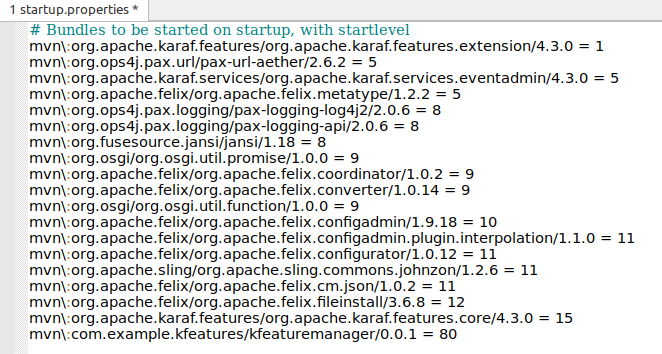
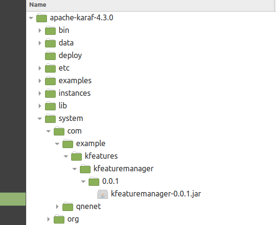

# kfeatures example
Karaf provides a service which can be used to install and uninstall features in your code rather than installing and uninstalling using the Karaf Console.

This service is called FeaturesService.

If this service is used in a bundle that is itself installed by a feature  it causes a dead lock.

To avoid this the bundle using the FeaturesService service must not be in a feature but has to be installed directly as a bundle.

You can install a bundle directly in the console with bundle:install but we want to be able to not have to do this manually in the console.

In this example we have 3 modules.

    1. KFeatureManager
        Bundle which uses FeaturesService to install and uninstall features.
    2. KFeatureWorker
        Bundle which has KFeatureManager as reference to add and remove features. 
    3. KFeatureFeatures
        The feature that runs this example.

Because the base Karaf install does not have Declarative Services (scr) installed by default we cannot build KFeatureManager as a DS component.

We need a lower level approach.

## To Run this Example

We need to list the KFeatureManager bundle in the karaf/etc/startup.properties file. 

Next add the KFeatureManager bundle to the Karaf systems directory so that Karaf can find the bundle when it starts.

1. Build the project with maven
2.  

